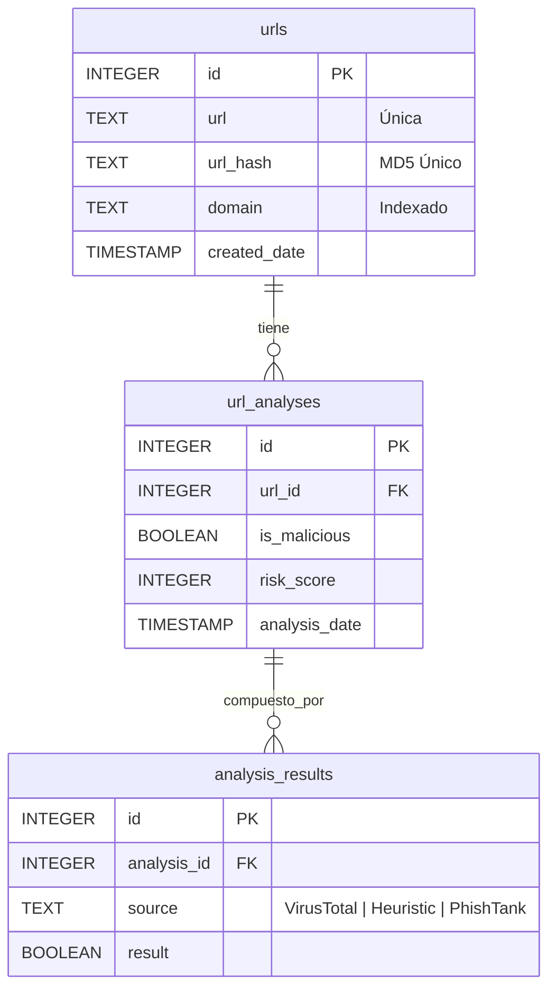

# PhishShield 🛡️ - Detector de Phishing en URL

PhishShield es una solución integral y de alto rendimiento para la detección, análisis y mitigación de amenazas asociadas a URLs maliciosas y campañas de Phishing. El sistema combina técnicas de consulta a bases de datos de reputación global (VirusTotal, PhishTank), un motor de análisis heurístico avanzado con explicabilidad inmediata (IA Explicable), una base de datos local altamente optimizada bajo la **Cuarta Forma Normal (4NF)**, y utilidades de recolección masiva para auditorías y entrenamiento de modelos.

---

## 🚀 Características Principales

*   **Detección en Tiempo Real Híbrida**: Combina la potencia de APIs externas con un motor heurístico local sumamente rápido.
*   **Motor Heurístico Avanzado**: Evalúa múltiples características léxicas, presencia de typosquatting en el dominio, uso de IPs, ofuscación de caracteres, seguridad SSL/TLS y edad de dominio.
*   **IA Explicable (Explainable AI)**: Cada decisión heurística va acompañada de una lista detallada en lenguaje natural que justifica por qué se ha marcado una URL como sospechosa o maliciosa.
*   **Base de Datos Normalizada (4NF)**: Implementada en SQLite, estructura que evita la redundancia de datos separando la entidad URL de sus análisis individuales e históricos de fuentes de verificación.
*   **Scraping Masivo Multihilo**: Scraper avanzado capaz de rastrear de forma concurrente cientos de sitios de alta fidelidad para generar datasets de prueba de miles de URLs en minutos.
*   **Analizador por Lotes (Bulk Analyzer)**: Script interactivo para procesar archivos masivos de URLs respetando políticas de tasa de consulta (*rate limits*) a través de hilos paralelos optimizados.
*   **Dashboard Moderno e Interactivo**: Panel de control web desarrollado en Flask, que incluye gráficos de distribución de riesgos, historial interactivo de análisis, documentación interactiva de la API REST, y más.

---

## 📁 Estructura del Proyecto

La estructura del repositorio está organizada de la siguiente manera:

```text
├── URL/
│   ├── templates/                  # Plantillas HTML del Dashboard
│   │   ├── base.html               # Plantilla maestra (Layout principal)
│   │   ├── index.html              # Panel principal y Analizador de URLs
│   │   ├── stats.html              # Panel de estadísticas detalladas y gráficas
│   │   ├── docs.html               # Documentación general del sistema
│   │   ├── api_rest.html           # Documentación interactiva de la API REST
│   │   ├── blog.html               # Sección informativa y artículos
│   │   ├── terms.html              # Términos y condiciones de uso
│   │   ├── privacy.html            # Políticas de privacidad
│   │   ├── gdpr.html               # Cumplimiento RGPD (GDPR)
│   │   └── security.html           # Información de seguridad
│   ├── app.py                      # Servidor Web Flask y API REST
│   ├── auto_url_scraper.py         # Generador masivo de URLs (Web Scraper multihilo)
│   ├── bulk_analyzer.py            # Script interactivo de procesamiento masivo
│   └── url_analyzer.db             # Base de datos SQLite (Generada automáticamente)
├── .env.example                    # Plantilla para variables de entorno
├── .gitignore                      # Reglas de exclusión de Git
├── requirements.txt                # Dependencias del proyecto
└── README.md                       # Documentación principal (este archivo)
```

---

## 🛠️ Requisitos e Instalación

### Requisitos Previos

*   Python 3.8 o superior.
*   Conexión a Internet activa (para consultas externas de WHOIS, VirusTotal y PhishTank).

### Paso 1: Clonar e Instalar Dependencias

1.  Asegúrate de estar en el directorio raíz del proyecto e instala las dependencias necesarias:
    ```bash
    pip install -r requirements.txt
    ```

### Paso 2: Configurar Variables de Entorno

1.  Copia el archivo de ejemplo para crear tu entorno local:
    ```bash
    cp .env.example .env
    ```
2.  Edita el archivo `.env` e ingresa tu clave API de VirusTotal (puedes obtener una de forma gratuita registrándote en [VirusTotal](https://www.virustotal.com/)):
    ```env
    VIRUSTOTAL_API_KEY=tu_api_key_real_de_virustotal_aqui
    ```

---

## 📊 Arquitectura y Base de Datos (4NF)

La base de datos local SQLite está diseñada bajo la **Cuarta Forma Normal (4NF)**, lo cual garantiza una óptima atomicidad, evita la redundancia de datos y permite realizar un seguimiento histórico exhaustivo del estado de las URLs en el tiempo.

### Diagrama de Relación (4NF)



*   **`urls`**: Almacena de forma inmutable la URL analizada, su dominio y un hash único (MD5) para acelerar las búsquedas por índice.
*   **`url_analyses`**: Registra cada evento de análisis individual. Una URL puede ser analizada múltiples veces en diferentes días, permitiendo evaluar la evolución de la amenaza.
*   **`analysis_results`**: Guarda el desglose detallado de los resultados individuales por cada motor (VirusTotal, PhishTank, Heurístico) asociado a un análisis en particular.

---

## 🖥️ Uso de los Componentes

### 1. Iniciar la Aplicación Web (Flask Server)

Para arrancar el panel de control web interactivo y la API de detección en tiempo real, ejecuta:

```bash
python URL/app.py
```

Por defecto, el servidor se iniciará en `http://localhost:5000`. Abre este enlace en cualquier navegador web para acceder al Dashboard interactivo donde podrás:
*   Ingresar URLs de forma manual y obtener análisis heurísticos instantáneos.
*   Observar la explicación exacta de cada penalización heurística en tiempo real.
*   Ver estadísticas detalladas de URLs seguras vs maliciosas y la distribución por dominios.
*   Consultar el historial completo de escaneos guardados en la base de datos.

---

### 2. Generación Masiva de URLs (`auto_url_scraper.py`)

Si necesitas construir o expandir un dataset masivo con fines de prueba u optimización heurística, este script rastrea de forma paralela más de 200 sitios web clasificados en diferentes categorías (educación, noticias, comercio, entretenimiento).

Ejecuta el scraper con:
```bash
python URL/auto_url_scraper.py
```

*   **Parámetros configurables**: Puedes editar el número de hilos paralelos (`max_workers`) y el objetivo total de URLs (`target_urls`) directamente en la función `main()` de `auto_url_scraper.py`.
*   **Resultado**: Genera un archivo optimizado llamado `urls_to_analyze.csv` listo para ser ingerido por el analizador por lotes.

---

### 3. Analizador Masivo por Lotes (`bulk_analyzer.py`)

Procesa archivos enteros de URLs de manera ágil e interactiva, consultando tu propio servidor Flask y registrando los resultados directamente en la base de datos centralizada.

Ejecuta el analizador con:
```bash
python URL/bulk_analyzer.py
```

*   **Interactividad**: El script detecta de forma automática qué URLs ya existen en la base de datos y te preguntará si deseas analizar solo las nuevas para optimizar el consumo de recursos y APIs.
*   **Seguridad**: Incorpora retrasos dinámicos entre consultas (`DELAY_BETWEEN_REQUESTS`) para respetar las cuotas de red y las APIs externas.
*   **Estadísticas finalizadas**: Al concluir, exportará un informe completo por consola con el top de dominios maliciosos, la evolución temporal de los últimos 7 días y la distribución de niveles de riesgo.

---

## 🔍 Reglas del Motor Heurístico

El algoritmo heurístico evalúa el riesgo global de una URL asignando un puntaje acumulativo entre **0 y 10**. Si el puntaje total es **mayor o igual a 3**, la URL es clasificada automáticamente como **Maliciosa/Sospechosa**.

Las reglas de penalización aplicadas son:

| Característica / Regla | Penalización | Descripción / Razón |
| :--- | :---: | :--- |
| **Dominio No Registrado** | `+3 puntos` | El dominio no existe en los registros globales de WHOIS. |
| **Dominio Muy Nuevo (<30 días)** | `+2 puntos` | Creado recientemente, patrón clásico de campañas de phishing efímeras. |
| **Longitud Excesiva (>75 caract.)** | `+1 punto` | Ofuscación léxica mediante rutas excesivamente largas. |
| **Exceso de Guiones (>3)** | `+2 puntos` | Intento de imitar subdominios o nombres de marcas (e.g., `paypal-login-secure.com`). |
| **Dirección IP en Host** | `+2 puntos` | Uso directo de una dirección IP (e.g., `http://192.168.1.1/login`) en lugar de un nombre de dominio legítimo. |
| **Sin HTTPS** | `+2 puntos` | Transmisión de datos sin cifrar, inaceptable para páginas seguras de login. |
| **Exceso de Parámetros '=' (>3)** | `+1 punto` | Paso de variables complejas para evasión de filtros. |
| **Exceso de Puntos '.' (>5)** | `+1 punto` | Uso excesivo de subdominios falsos. |
| **Exceso de Guiones Bajos '_' (>2)** | `+1 punto` | Caracteres atípicos de separación en hosts legítimos. |
| **Exceso de Barras '/' (>5)** | `+1 punto` | Directorios anidados profundos utilizados para ocultar el host real. |
| **Exceso de Consultas '?' (>3)** | `+1 punto` | Estructuras de query complejas. |
| **Presencia del Carácter '@'** | `+2 puntos` | El navegador ignora todo lo anterior al símbolo `@`, permitiendo simular una URL real al inicio. |
| **Puerto Personalizado** | `+1 punto` | Uso de puertos poco comunes en tráfico web estándar (distintos a 80 y 443). |
| **Palabras Clave de Phishing** | `+1 a +3 ptos` | Inclusión de términos como `login`, `verify`, `secure`, `account`, `banking`, `paypal`, `password`. |
| **Dígitos en el Dominio** | `+1 a +2 ptos` | Typosquatting recurrente reemplazando letras por números similares (e.g., `g00gle.com`). |

---

## 🌐 API REST Endpoints

PhishShield expone un conjunto de endpoints RESTful para integraciones externas:

### 1. Analizar URL
*   **Ruta**: `/analyze`
*   **Método**: `POST`
*   **Cuerpo (JSON)**:
    ```json
    { "url": "https://url-a-analizar.com" }
    ```
*   **Respuesta (JSON)**:
    ```json
    {
      "url": "https://url-a-analizar.com",
      "is_malicious": true,
      "risk_score": 6,
      "phish_result": false,
      "virustotal_result": false,
      "features": { ... },
      "domain_age": 14,
      "heuristic_reasons": [
        "Dominio muy nuevo (14 días)",
        "No usa HTTPS (conexión no segura)",
        "Contiene palabras típicas de phishing"
      ]
    }
    ```

### 2. Historial de una URL
*   **Ruta**: `/api/url-history`
*   **Método**: `POST`
*   **Cuerpo (JSON)**:
    ```json
    { "url": "https://url-a-analizar.com" }
    ```

### 3. Obtener Datos Detallados de VirusTotal
*   **Ruta**: `/virustotal-data`
*   **Método**: `POST`
*   **Cuerpo (JSON)**:
    ```json
    { "url": "https://url-a-analizar.com" }
    ```

### 4. Estadísticas Globales
*   **Ruta**: `/api/stats`
*   **Método**: `GET`

### 5. Listado de URLs Escaneadas
*   **Ruta**: `/api/urls`
*   **Método**: `GET`

---

## 🌐 Despliegue en la Nube y Demo en Vivo

El proyecto está preparado para ser desplegado fácilmente en plataformas PaaS como **Render**. 

### 🛡️ Enfoque de Privacidad por Diseño (Privacy-by-Design)

Para la demostración en vivo alojada en entornos de acceso público, hemos adoptado un enfoque de arquitectura enfocado en la privacidad y mitigación de abusos:

*   **Almacenamiento Efímero (SQLite)**: La base de datos SQLite se ejecuta dentro del sistema de archivos volátil de la instancia gratuita de Render. Esto significa que la base de datos se restablece automáticamente a su estado original cada vez que el contenedor entra en reposo por inactividad.
*   **Gobernanza y Privacidad**: Ninguna URL real o sensible que un visitante o reclutador ingrese en la demo en vivo para probar el sistema quedará expuesta de forma permanente en el historial de escaneos para futuros visitantes.
*   **Mitigación de Abuso y Spam**: Al no contar con almacenamiento persistente compartido públicamente, se neutraliza por completo el riesgo de que actores malintencionados vandalicen la demo pública inyectando enlaces inapropiados o fraudulentos en el historial y el dashboard de estadísticas.
*   **Portabilidad**: Este diseño efímero garantiza un consumo cero de costos de base de datos en la nube y un mantenimiento nulo. Para un entorno de producción persistente, el sistema puede ser migrado en segundos a un motor dedicado (como PostgreSQL) modificando únicamente el driver en la capa de datos.

---

## 🛡️ Licencia y Buenas Prácticas

Este software se proporciona con fines educativos, de investigación y auditoría de seguridad. Al realizar scraping masivo o análisis por lotes de dominios ajenos, asegúrate de cumplir con los términos de servicio de los destinos y de contar con las autorizaciones pertinentes.
